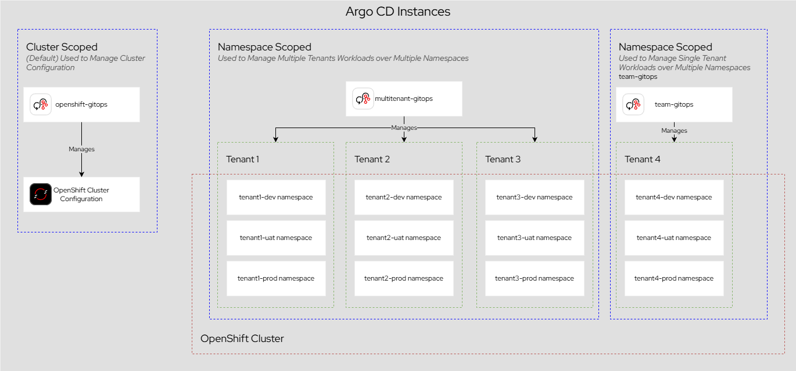
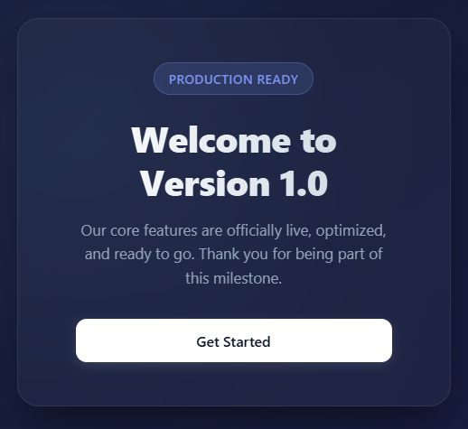
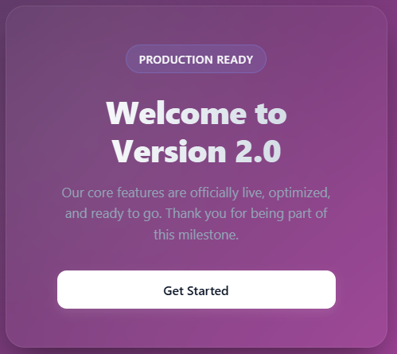
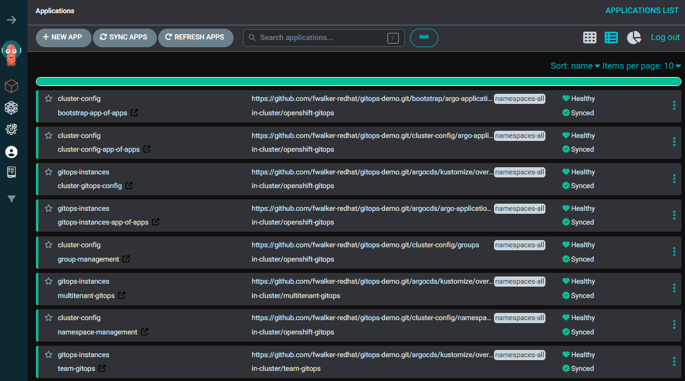

# Very Basic GitOps Demo

## Introduction

This demonstrates using OpenShift GitOps to manage both the OpenShift Cluster configuration and User workloads. The `default` OpenShift GitOps instance, deployed by default to the `openshift-gitops` namespace, should be used solely for Cluster configurations since it is configured to allow managing of the majority of cluster scoped resources. 2 additional instances are deployed for User workloads to illustrate multi-tenancy strategies: a single instance that relies heavily on ArgoCDs RBAC model along with ArgoCD Projects to provide multi-tenancy, and an instance dedicated to a single group which provides better isolation but at the cost of consuming additional resources.



## Set Up

1. 
2. Clone the repository using the `namespaces-dev-only` tag: `git clone -b namespaces-dev-only https://github.com/fwalker-redhat/gitops-demo.git`
3. In order to bootstrap the correct ArgoCD Application Projects (`appproject`) resources need to be created first. This can be achieved by running the following command: `oc project openshift-gitops; oc apply -f argocds/kustomize/overlays/cluster/projects`

### Preparing Container Images for Argo Rollouts and ImageUpdater

A very basic NGINX container image is provided that will display a page with a version number and particular background color for demonstration purposes. The expectation is that the first release will be tagged with `v1.0` and the second release will be tagged with `v2.0`.

The `Containerfile` for each can be found under `demo-image/<version>/Containerfile`.

#### Version 1.0:



#### Version 2.0:



## Instructions

1. Display the GitOps views on the OpenShift Console with the `openshift-gitops` and navigate through the Applications and AppProjects which should have no Applications and 3 AppProjects (`cluster-config`,`default`,`gitops-instances`) with OpenShift versions that support the GitOps plugin. For those OpenShift versions that do not support the plugin navigate to the default ArgoCD instance and display 
2. Apply the bootstrap Argo CD Application. This can be achieved by running the following command: `oc project openshift-gitops; oc apply -f bootstrap/bootstrap-app-of-apps.yaml`
3. This should result in a total of 8 applications deployed to the `default` GitOps instance found in the `openshift-gitops` namespace. 3 follow the [**App of Apps**](https://argo-cd.readthedocs.io/en/latest/operator-manual/cluster-bootstrapping/#app-of-apps-pattern-alternative) pattern, 1 uses a Helm chart, 3 use Kustomize and 1 is pure resource manifests.
  1. App of Apps Applications:
    1. `bootstrap-app-of-apps`: Wraps `cluster-config-app-of-apps` and `gitops-instances-app-of-apps`
    2. `cluster-config-app-of-apps`: Wraps `group-management` and `namespace-management` 
    3. `gitops-instances-app-of-apps`: Wraps `cluster-gitops-config`, `multitenant-gitops` and `team-gitops`
  2. Helm Applications:
    1. `namespace-management`: Creates and labels namespaces and assigns rolebindings to nominated groups for `admin` and `edit` clusterrole. Using the `namespaces-dev-only` tag will create a `dev` namespaces for each tenant named with the format of \<tenant-name\>-dev. Using the `namespaces-all` tag will create a `uat` and `prod` namespace for each tenant with the format of \<tenant-name\>-\<env\>
  3. Kustomize Applications:
    1. `cluster-gitops-config`: Creates ArgoCD Projects (`appproject`) for `cluster-config` and `gitops-instances`. `cluster-config` is manageable by members of the `cluster-admins` group and `gitops-instances` is manageable by members of the `gitops-admins` group. This illustrates using ArgoCD Projects to logically separate applications by function and leverage ArgoCD's RBAC model
    2. `multitenant-gitops`: Creates an ArgoCD instance through the GitOps operator that has 3 tenant projects (`tenant1`, `tenant2`, `tenant3`). Each project allows deployment to namespaces that begin with the corresponding tenant name, i.e. for `tenant1` any namespaces beginning with `tenant1-`. Each project is manageable by members of a group in the format of \<tenant-name\>-admin and members of a group in the format of \<tenant-name\>-devs can view applications and logs and synchronize applications. This illustrates using ArgoCD Projects to logically separate applications by tenant (multi-tenancy) by leveraging ArgoCD's RBAC model
    3. `team-gitops`: Creates an ArgoCD instance through the GitOps operator that has a single tenant, `tenant4`, with a single project. This illustrates having a dedicated ArgoCD instance per tenant as an alternative to a multi-tenant single instance.
4. Navigate to the applications and synchronize the 2 additional ArgoCD instances.



## Confirming behavior of Rollouts

As this is a naive implementation relying solely on Kubernetes services to perform load balancing between versions there is not guarantee that refreshing the browser will result in displaying a particular version. Running a command loop will provide a more suitable way to validate behaviour:

```shell
counter=1; while [ true ]; do echo $counter; curl -s https://<destination>/ | grep "Version 2"; ((counter++)); done
```